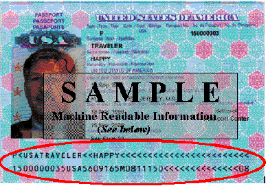
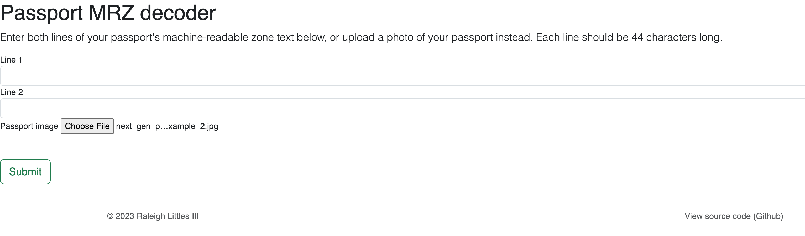
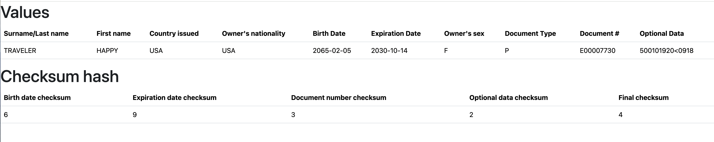
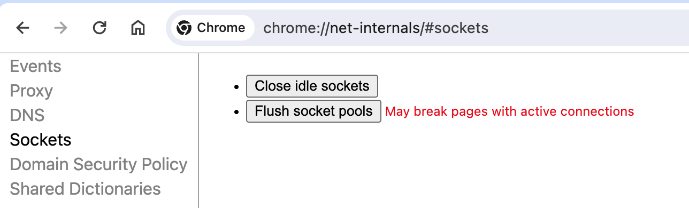

# Context

If you've ever looked closely at your passport, you'll notice 2 lines of text at the bottom.



This is called the "machine-readable zone" and it encodes basic information about your passport. At border checkpoints, its used to verify that the info in your passport isn't falsified and that your passport isn't expired.

I couldn't find any online, open-source MRZ decoders so I decided to make my own.

# About

This repository contains a simple MRZ decoder for passports. It consists of a Flask webapp that lets you either: (1) enter your own passports MRZ as text (2) upload a photo of your passport; to view the decoded MRZ results.



Here's the result of a sample submission:



**Note**: So far it's only been tested on <u>American</u> passports. Other passports that use the TD3 or MRV-A standards (which have 2-line, 44-characters-per-line MRZ) should theoretically work. See the further reading section for more info.

The `examples` folder contains some examples of passports to test with.

# Usage/Setup

Install dependencies:

```bash
$ pip install -r requirements.txt
```

Load flask app:

```bash
$ flask --app main run --debug
```

# Troubleshooting

## Flask app won't connect?

Go to: `chrome://net-internals/#sockets`

click "Flush socket pools"



# Further reading

* [MRZ library documentation](https://pypi.org/project/mrz/)

* ICAO Document 9303 (official standards) -- see `extras` folder